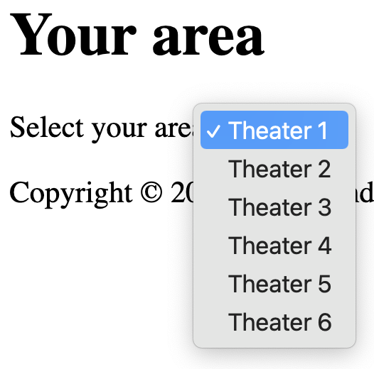
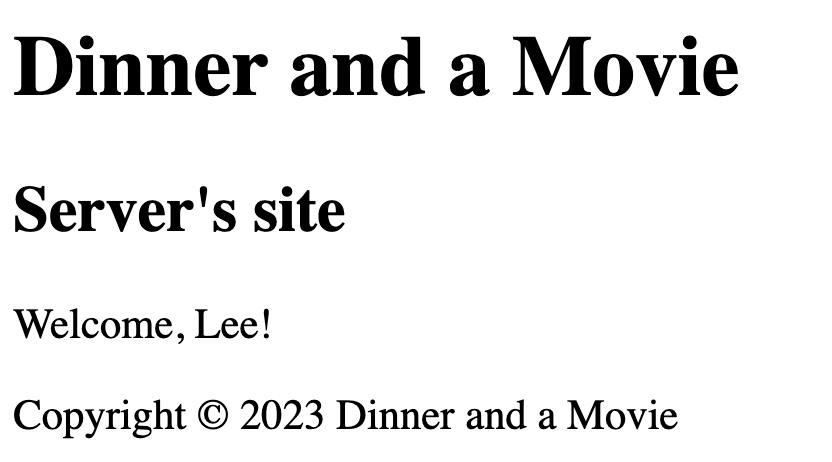
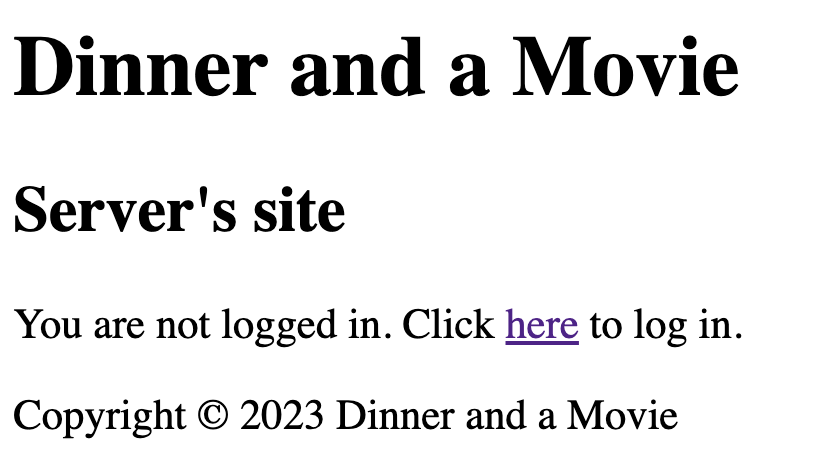

# *ngFor and *ngIf
<!-- Time: YYmin -->
Alright, this is where Angular really gets fun! These built-in directives are where logic is applied in your Angular app.

## Iterating areas
We'll start off with a simple one. We want the waiter to choose the area that they'll be serving. Let's load up the data in the TypeScript class and then display it in the HTML.



1. Add an array of strings to `areas.component.ts`.
```typescript
export class AreasComponent {
  areas: Array<string> = [
    "Theater 1", "Theater 2", "Theater 3", "Theater 4", "Theater 5", "Theater 6",
  ];
}
```

2. Iterate them in `areas.component.html`
```html
<h1>Your area</h1>
<label for="area">Select your area</label>
<select id="area">
  <option *ngFor="let a of areas" [value]="a">{{a}}</option>
</select>
```

3. Run your app. Navigate to "areas". See them? Picking one doesn't do anything yet but that'll come in a few chapters.

## Iterating all the orders
Our app must show the waiter all orders that need to be picked up. 

1. Look at `orders.service.ts`. Remember how we've created a currentOrders signal to monitor all orders?
```typescript
const obs$ = this._http.get(`/api/orders/current`);
this.currentOrders = toSignal(obs$)
```
Let's use it!

2. Make `orders.component.ts` look like this:
```typescript
export class OrdersComponent {
  orders: Signal<any[]> = this._ordersService.currentOrders;

  constructor(private _ordersService: OrdersService) { }
}
```
Now you've got all the orders in a signal called this.orders. We just have to iterate those orders in the template.

3. Iterate the orders in `orders.component.html`
```html
<h1>Orders</h1>
<div *ngFor="let order of orders()" [routerLink]="'/orders/'+order.id">
  id: {{order.id}}
  area: {{order.area}}
  status: {{order.status}}
</div>
```

4. Run the app. Look! You've got some orders ready for your waiters! If you click on any of those orders, you'll navigate to the details page for that order. Try it out!

## Conditionally displaying
On the home view, we want the user to see a different view depending on whether they're logged in or logged out.

If they're logged in:



And if they're logged out:



How do we know? Well, if they're logged in, the `user` signal from the AuthService will have something in it. If not, it will be undefined.

1. Inject the AuthService into `home.component.ts` so the user signal can be seen. Then create a property in the component that can be bound in the template.
```typescript
export class HomeComponent {
  restaurantName: string = "Dinner and a Movie";
  user: any = this._authSvc.user;
  constructor(private _authSvc: AuthService) { }
}
```

2. Make `home.component.html` welcome the user by name if they're logged in and "You're not logged in" if not:
```html
<h1>{{restaurantName}}</h1>
<h2>Server's site</h2>

<p *ngIf="user()">Welcome, {{ user().first }}!</p>
```

3. View your app in a browser. At first, the `<p>` will not appear. Then choose "Log in" from the menu and hit the log in button. Now the home component will greet you by name.

4. Let's provide the alternative. If the user is NOT logged in, we'll tell them. Add a `<ng-template>` and use the `else` clause to point to it:
```html
<h1>{{restaurantName}}</h1>
<h2>Server's site</h2>

<p *ngIf="user() ; else noUser">Welcome, {{ user().first }}!</p>
<ng-template #noUser>
  <p>You are not logged in. Click <a [routerLink]="'/login'">here</a> to log in.</p>
</ng-template>
```

5. View your app again. Does it switch as expected?

## Conditionally showing buttons
We have to allow the server to update an order's status. It would be smart to only show the server the options that are logical. So based on the current status, we want to show only the appropriate buttons.

1. Edit `order.component.ts`. Add a simple method to handle setting the status:
```typescript
setStatus(status: string) {
  this._ordersService.setStatusOnCurrentOrder(status);
}
```

2. Now edit `order.component.html`. Add two buttons:
```html
<div class="status-changing">
  <button (click)="setStatus('pickedUp')">Picked up</button>
  <button (click)="setStatus('problem')">Problem</button>
</div>
```

3. Look at it in the browser. Any order will have these two buttons.

4. Add an `*ngIf` attribute to make that set of buttons conditional:
```html
<div *ngIf="order().status === 'readyForGuest'" class="status-changing">
```

5. Again, view in a browser. Navigating to an order that is `readyForGuest` will have the buttons. If not, no buttons appear.

We should do this for four sets of buttons:

| When the order is ... | It can go to ... | or it can go to ... |
| --------------------- | ---------------- | ------------------- |
| readyForGuest         | pickedUp         | problem             |
| pickedUp              | delivered        | problem             |
| delivered             | problem          |                     |
| problem               | delivered        | complete            |

6. Now you write the code to handle the other three sets. If you need help here's the solution:
<details>
<summary>Expand for a possible solution</summary>

```html
<div *ngIf="order().status === 'readyForGuest'" class="status-changing">
  <button (click)="setStatus('pickedUp')">Picked up</button>
  <button (click)="setStatus('problem')">Problem</button>
</div>
<div *ngIf="order().status === 'pickedUp'" class="status-changing">
  <button (click)="setStatus('delivered')">Delivered</button>
  <button (click)="setStatus('problem')">Problem</button>
</div>
<div *ngIf="order().status === 'delivered'" class="status-changing">
  <button (click)="setStatus('problem')">Problem</button>
</div>
<div *ngIf="order().status === 'problem'" class="status-changing">
  <button (click)="setStatus('delivered')">Delivered</button>
  <button (click)="setStatus('completed')">Completed</button>
</div>
```
</details>

7. Run your app. Navigate to an order and look at its status. Do the buttons make sense? Click one. Because we're changing a signal, the page should update immediately -- as soon as the signal changes. Give it a try. The status will change and the buttons will change.